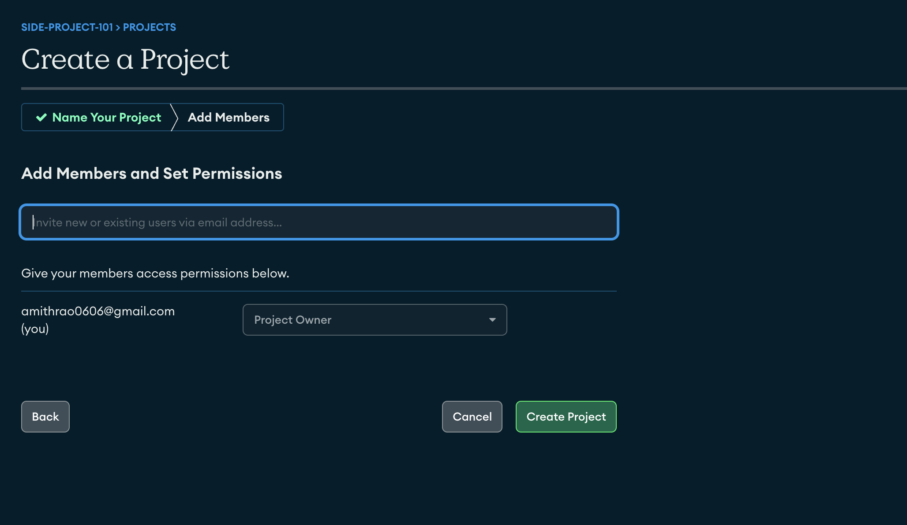

# MongoDB Connection

### How to get MongoDB connection string :

##

**Step 1** : Create an account here, https://account.mongodb.com/account/login

OR

If you already have an account, please Sign-in

##

**Step 2** : Create an Organization. Name your org accordingly.

NOTE : Skip this step if you already have an account and Organization created.

##

**Step 3** : Inside the Organization create a new project and name it as "Anonyfy". Tags field can be left empty as it is optional.

After clicking "Next" button, you'll be asked to Add Members and Set Permissions. By default the creator of the project(you) will be the first Member of the project.

Currently if you don't want to add a member, you can leave this field empty and click on "Create Project"

Then, you'll be redirected to the dashboard.

##

**Step 4** : From the dashboard, navigate to "Network Access" section from the menu on the left-hand side of your screen.

Then click on "Add current IP Address" button.

This will enable you to interact with the database through the device you're using right now.

Then, navigate to "Clusters" section and click on "Build a Cluster" button.

##

**Step 5** : Create a cluster inside the newly created project i.e "Anonyfy".

Select free teir, name the cluster accordingly, chose the region nearest to where you live and click on "Create deployment" button.

<b>NOTE</b> : Try not to change the default name of the cluster as it will affect the connection string.

##

**Step 6** : Then you'll be redirected to a page where you'll be given the username and password to connect to the database.

Then click on "Create Database user" button. After creating the user click on "Choose a connection method".

##

**Step 7** : Choose the tools through which you want to access the database.

Choose the "compass" option.

##

**Step 8** : Now you'll be asked to download the "MongoDB Compass". It's not a compulsory step.

Then finally you'll have the connection string which you can copy and past it in the environment variables `.env` of your project. 

Finally click on "Done" button.

##