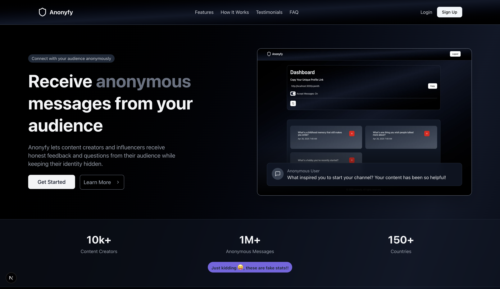

# Welcome to Anonyfy!

<div align="center">  
    <h3>
        Receive messages without revealing your identity
    <h3>
</div>
    
##

## 📄 About the Project

- <ins><b>Anonyfy</b></ins> is a full-stack web application that allows users to receive anonymous feedback through unique profile links. 

- Users can easily create an account, share their profile, and start receiving messages from anyone without revealing their identity. 

- With a focus on privacy, user experience, and simplicity, Anonyfy provides an intuitive platform for gathering honest opinions, compliments, or constructive criticism. 

- Built using modern technologies like Next.js, Prisma, and TailwindCSS, Anonyfy ensures a smooth, fast, and secure experience.

## ✨ Features

**Anonymous Messaging** : Anyone can send you messages without creating an account.

**Unique User Links** : Each user gets a unique link they can share to receive feedback.

**Authentication** : Secure login/signup system with NextAuth.js (Email or OAuth if configured).

**Dashboard** : Users can view received messages in a private dashboard.

**Message Management** : Ability to delete unwanted messages from the dashboard.

**Responsive UI** : Mobile-first, beautifully designed with TailwindCSS.

## 🛠 Tech Stack

- **Next.js** : Full-Stack React Framework
- **React.js** : Frontend
- **TypeScript** : Type-Safety
- **TailwindCSS** : Styling
- **Shadcn-UI** : UI Library
- **react-email** : For email templates
- **Resend** : For sending out the actual email.
- **MongoDB** : Database
- **Mongoose** : ODM for MongoDB
- **NextAuth.js** : Authentication
- **Zod** : Data Validation

## 🧑‍💻 Local Development Setup

Follow these steps to set up Anonyfy locally:

**1. Clone the repository** :

```bash
git clone https://github.com/your-username/anonyfy.git
cd anonyfy
```

##

**2. Install dependencies** :

```bash
pnpm install
# or
npm install
# or
yarn install
```

##

**3. Copy the variables from `.env.sample` to `.env`** :

```bash
cp .env.sample .env
```

##

**4. Set up environment variables** :

```
MONGODB_URI=mongodb+srv://<username>:<password>@cluster0.fgdlagf.mongodb.net/Anonyfy?retryWrites=true&w=majority&appName=Cluster0

RESEND_API_KEY="Enter resend Api Key obtained from https://resend.com/"

NEXTAUTH_SECRET="Enter anything you want. Any kind of password is fine."
```

**NOTE** :

1. Refer [this](MONGO-DB.md) for obtaining the connection string from [MongoDB](https://cloud.mongodb.com). Then replace the username and password of the above given connection string with the actual username and paasword received from the MongoDB.

2. For getting the Resend API key, watch the following YouTube video : From (4:17)
https://youtu.be/fEeksraKfJI?si=S_t-ADL2rTYLa0iK

3. For the "NEXTAUTH_SECRET", you can give any secret. 

For Example : NEXTAUTH_SECRET=your_name_101

##

**5. Start the development server** :

```bash
pnpm dev
# or
npm run dev
# or
yarn dev
```

<b>NOTE</b> : Visit http://localhost:3000 🚀

## 📜 License

[MIT License](LICENSE)

## 🛠 Contribution Guide

We welcome contributions! To contribute:

1. Fork the project.

2. Create a feature branch (git checkout -b feature/your-feature)

3. Commit your changes (git commit -m 'Add your feature')

4. Push to your fork (git push origin feature/your-feature)

5. Open a Pull Request

**NOTE** : Please make sure your code follows the existing style and passes all linting checks.

## ❤️ Built with love by Amith B V